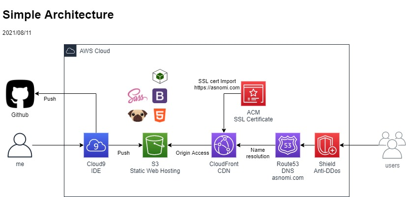

# asnomi.com contents repos
## Whats repositry?

あすのみの[Webサイト](https://asnomi.com)のフロントエンド部分を管理してるリポジトリ。  
インフラ側は別リポジトリで管理(予定)

## Architecture

単純構成  


## Operation manual
### Directorys and Files
ディレクトリ構成とファイルは以下の配置となっている。

```
.
├── docroot
│   ├── contents/ # 雑多なページ
│   ├── img/ # 画像置き場
│   ├── style/ # css置き場
│   ├── biography.html # biography
│   ├── discography.html # discography
│   └── index.html # index
├── pug
│   ├── include/ # 共通モジュール
│   ├── biography.pug # biographyページ
│   ├── discography.pug # discographyページ
│   ├── index.pug # indexページ
├── README.md # this file
├── deploy.sh # deploy script
└── env # 環境変数ファイル
```

### Create files and contents

+ pugファイルを作成もしくは編集して```pug/```以下に配置
+ cssファイルを作成もしくは編集して```docroot/style/```以下に配置
+ よしなに画像コンテンツを作成して```docroot/img/```以下に配置

### Deployment

以下スクリプトを実行

```bash
./deploy.sh
```

+ 実行される処理
  - S3のクリーンアップ
  - Pugコンパイル
  - S3にアップロード
  - CloudFrontのキャッシュ削除

S3のクリーンアップとキャッシュ削除は必要な場合にコメントアウトを外して有効化する。

## Require Tools

+ AWS CLI
+ Pug(Jade)
